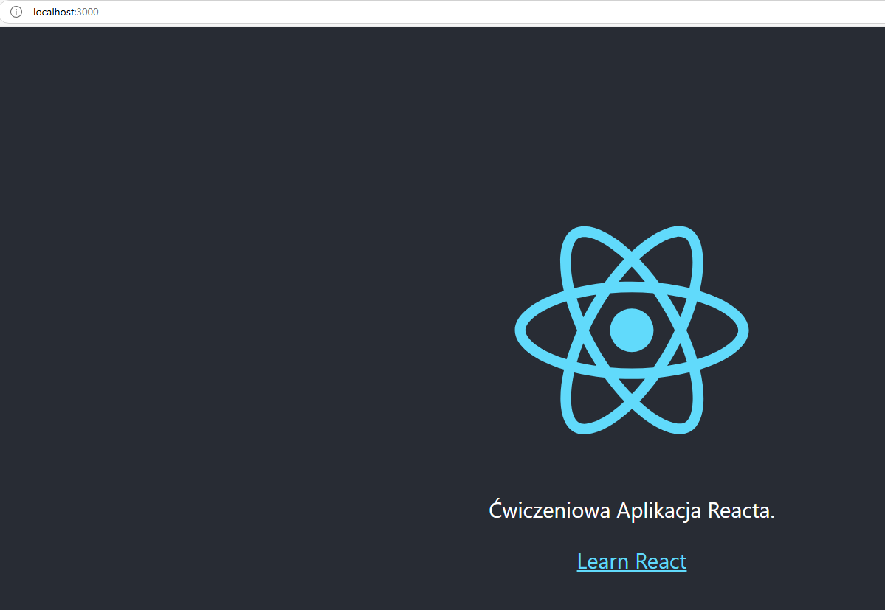

# Początek z Reactem

Ten projekt został uruchomiony z [Create React App](https://github.com/facebook/create-react-app).

## Dostępne skrypty

W tym projekcie możesz odpalić:

### `npm start`

Uruchamia aplikację w trybie deweloperskim.\
Open [http://localhost:3000](http://localhost:3000) aby wyświetlić go w przeglądarce.

Ta strona się odświeży, kiedy wprowadzisz jakieś zmiany.\
W konsoli mogą również pojawić się błędy.

### `npm test`

Uruchamia program uruchamiający testy w interaktywnym trybie oglądania.\
Więcej informacji można znaleźć w sekcji [running tests](https://facebook.github.io/create-react-app/docs/running-tests).

### `npm run build`

Buduje aplikację produkcyjną w folderze `build`.
Poprawnie łączy Reacta w trybie produkcyjnym i optymalizuje kompilację pod kątem najlepszej wydajności.

Kompilacja jest zminifikowana, a nazwy plików zawierają skróty.
Twoja aplikacja jest gotowa do wdrożenia!

Więcej informacji w sekcji [deployment](https://facebook.github.io/create-react-app/docs/deployment).

### `npm run eject`

**Uwaga: jest to operacja jednokierunkowa. Po `wyrzuceniu` nie można już wrócić!**

Jeśli nie jesteś zadowolony z wyboru narzędzia kompilacji i konfiguracji, możesz w dowolnym momencie `eject`. To polecenie usunie pojedynczą zależność kompilacji z projektu.

Zamiast tego skopiuje wszystkie pliki konfiguracyjne i zależności przechodnie (webpack, Babel, ESLint itp.) bezpośrednio do projektu, dzięki czemu będziesz mieć nad nimi pełną kontrolę. Wszystkie polecenia z wyjątkiem `eject` będą nadal działać, ale będą wskazywać na skopiowane skrypty, dzięki czemu będzie można je dostosować. W tym momencie jesteś zdany na siebie.

Nie musisz nigdy używać `eject`. Zestaw funkcji jest odpowiedni dla małych i średnich wdrożeń i nie powinieneś czuć się zobowiązany do korzystania z tej funkcji. Rozumiemy jednak, że to narzędzie nie byłoby przydatne, gdybyś nie mógł go dostosować, gdy będziesz na to gotowy.

## Więcej

Możesz dowiedzieć się więcej [Create React App documentation](https://facebook.github.io/create-react-app/docs/getting-started).

By poznać React, sprawdź [React documentation](https://reactjs.org/).

### Podział kodu

Sekcja została przeniesiona tutaj: [https://facebook.github.io/create-react-app/docs/code-splitting](https://facebook.github.io/create-react-app/docs/code-splitting)

### Analiza rozmiaru pakietu

Sekcja została przeniesiona tutaj: [https://facebook.github.io/create-react-app/docs/analyzing-the-bundle-size](https://facebook.github.io/create-react-app/docs/analyzing-the-bundle-size)

### Tworzenie progresywnej aplikacji internetowej

Sekcja została przeniesiona tutaj: [https://facebook.github.io/create-react-app/docs/making-a-progressive-web-app](https://facebook.github.io/create-react-app/docs/making-a-progressive-web-app)

### Zaawansowana konfiguracja

Sekcja została przeniesiona tutaj: [https://facebook.github.io/create-react-app/docs/advanced-configuration](https://facebook.github.io/create-react-app/docs/advanced-configuration)
